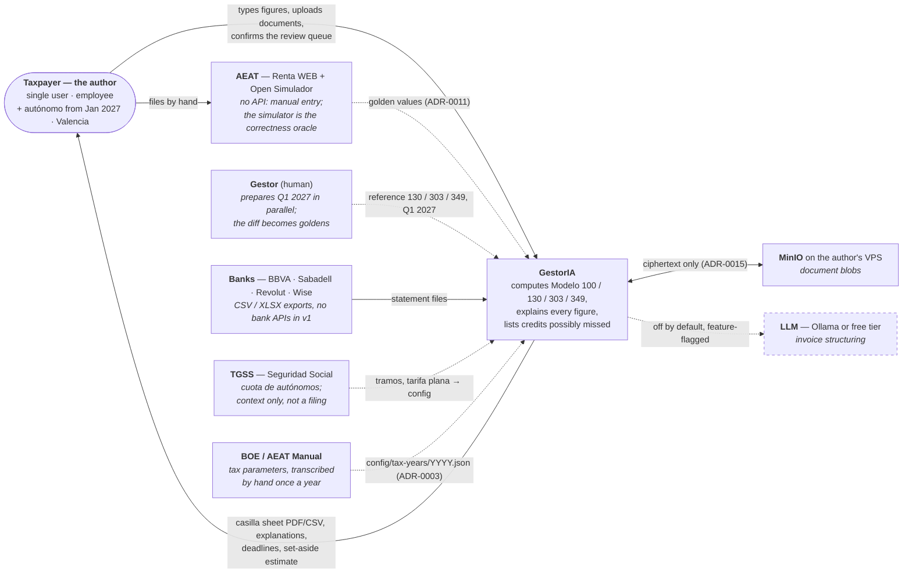
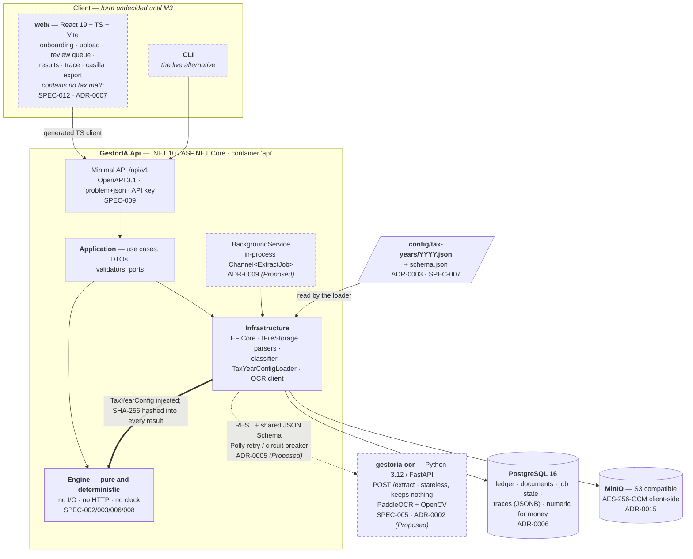
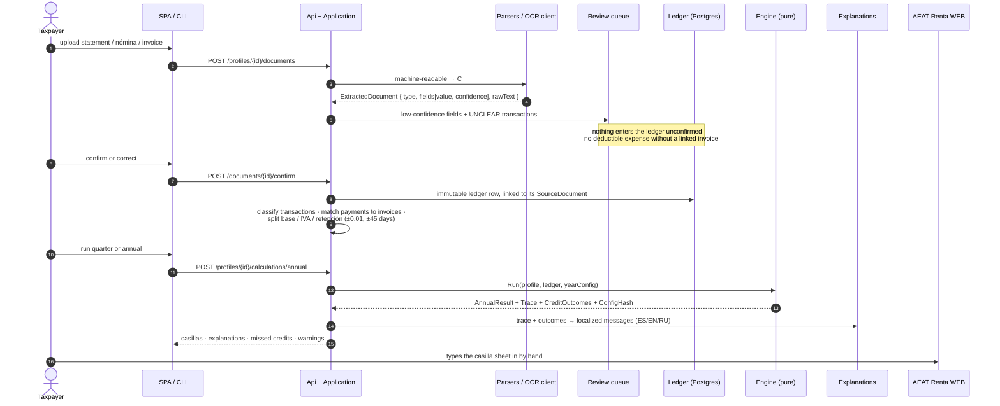
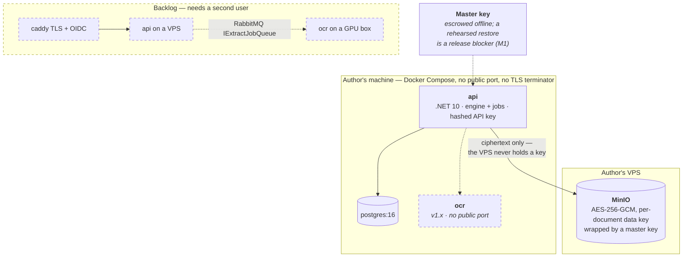

# Architecture

## Overview

**v1.0 scope (ADR-0013): Modelo 100, 130 and 303 for employees and autónomos, Valencia only, figures typed in by hand.** The OCR service below is deferred to v1.x; everything else is v1.0.

GestorIA turns raw personal financial documents (bank statements, nóminas, invoices, AEAT datos fiscales) into Spanish tax filings — Modelo 130/303 per quarter and Modelo 100 per year — with a step-by-step explanation of every figure and a list of tax credits the user may have missed. It is a two-service system plus a SPA. The **engine is pure**: given a profile, a ledger of confirmed documents and a year configuration, it deterministically produces a result and a trace. Everything else (parsing, OCR, storage, UI) exists to feed the engine correct inputs and show its outputs.

Decisions are recorded in `docs/adr/` (index: `docs/decisions.md`); module specifications in `docs/specs/`; roadmap in `plans/DEVELOPMENT_PLAN.md`.

---

## Goals

- Correct to the cent, reproducible, and explainable (trace from result → casilla → ledger row → source document).
- Nothing year-dependent hard-coded: all 📅 values live in `config/tax-years/YYYY.json`.
- Nothing enters a calculation unconfirmed; no deductible expense without a linked invoice.
- Zero-cost, self-hostable; a fully local deployment must be possible.

---

## System Context



**There is no integration with Hacienda.** GestorIA produces a casilla-by-casilla sheet
and the human files it. That is scope, not a limitation — e-filing is explicitly out
(`plans/DEVELOPMENT_PLAN.md` §1). The same AEAT that receives the filing also supplies
the golden values the engine is tested against, in the other direction and by hand.

Dashed edges and boxes, here and below, mean deferred or not yet built. What each one
means today is listed once, in `graph/architecture.md` → Gap vs target.

---

## System Components



Note where the config enters: the file is read by **Infrastructure** and handed to the
Engine already parsed and hashed. SPEC-007 §3 is explicit about why — put the loader in
the Engine and "the engine's purity becomes a comment rather than a property".

Containers actually deployed in v1.0: `api` and `postgres`, plus the MinIO already
running on the author's VPS. `ocr` and `caddy` are v1.x.


### Frontend — `web/` (React 19 + TypeScript, Vite)

Responsibilities: onboarding wizard, document upload, review queue (confirm/correct extracted fields and unclear transactions), quarterly and annual results, explanations, casilla sheet export. Contains **no tax math** — displays engine output only. SPEC-012.

Dependencies: generated OpenAPI client, TanStack Query, i18next (ES/EN/RU).

### Backend — `GestorIA.Api` (.NET 10, ASP.NET Core)

Layering (dependency arrows point inward only; the Engine never references EF Core, HTTP or the file system):

```
src/GestorIA.Domain          entities, value objects, enums                     (no dependencies)   SPEC-001
src/GestorIA.Engine          calculators, mappers, rule evaluator               (→ Domain)          SPEC-002/003/006/008
src/GestorIA.Application     use cases, DTOs, validators, ports (interfaces)    (→ Domain, Engine)
src/GestorIA.Infrastructure  EF Core, blob storage, OCR client, parsers, jobs   (→ Application)     SPEC-004/005
src/GestorIA.Api             endpoints, auth, OpenAPI, composition root         (→ Application, Infrastructure)  SPEC-009
tests/GestorIA.Engine.Tests  golden + property tests                            (→ Engine)          SPEC-011
tests/GestorIA.Api.Tests     integration tests (Testcontainers Postgres)        (→ Api)
```

Responsibilities: everything stateful and everything that computes. Dependencies: PostgreSQL 16 (EF Core), `gestoria-ocr` over REST, `config/tax-years`.

### Document extraction — `services/ocr` (Python 3.12, FastAPI)

Responsibilities: `POST /extract` — file in, structured fields with per-field confidence out. Stateless, keeps nothing. PaddleOCR + OpenCV pre-processing + per-document-type extractors; optional LLM structuring stage behind a flag. SPEC-005, ADR-0002.

Dependencies: none on the API; contract is `services/ocr/schema/extraction-result.schema.json` (ADR-0005).

---

## Integrations

External systems:

- AEAT Renta WEB Open Simulador — manual reconciliation benchmark for the engine (not an API).
- Bank statement exports (BBVA, Sabadell, Revolut, Wise) — file adapters, no bank APIs in v1.
- Optional LLM provider (Ollama local, or a free-tier cloud provider) for invoice structuring — off by default.

---

## Data Flow

Annual return:

1. **Ingest** — machine-readable files → C# parsers; PDFs/images → `gestoria-ocr`. Both yield `ExtractedDocument { type, fields[{name, value, confidence}], rawText }`.
2. **Review** — low-confidence fields and `UNCLEAR` transactions go to the review queue. Nothing enters the ledger unconfirmed.
3. **Ledger** — confirmed `Nomina`, `FacturaEmitida`, `FacturaRecibida`, `BankTransaction`, `Pago130/303`, each linked to its source document.
4. **Classify & match** — transactions get a class (Theory §15.2); client payments are matched to issued invoices and split into base / IVA / retención.
5. **Calculate** — `IrpfAnnualCalculator.Run(profile, ledger, yearConfig)` → `AnnualResult { casillas, trace, jointComparison, creditOutcomes, warnings, configHash }`.
6. **Explain** — trace + credit outcomes → localized messages; "possible credits" list missing documents.
7. **Export** — casilla sheet (PDF/CSV) for manual entry into Renta WEB.



Quarterly flow is identical up to step 4, then `Modelo130Calculator` / `Modelo303Calculator` with cumulative year-to-date inputs.

---

## Deployment

| Mode | Where | Status |
|---|---|---|
| Local-only | the author's machine, Docker Compose, no public port. Documents in MinIO on his VPS, encrypted client-side (ADR-0015) | **v1.0** (ADR-0010) |
| Single VPS | one host, Docker Compose, Caddy TLS | backlog — needs a second user first (ADR-0010 supersedes ADR-0008) |
| Split | API on VPS, OCR on a GPU box | later — requires the RabbitMQ `IExtractJobQueue` (ADR-0009) |



The engine never reads documents, so MinIO being unreachable cannot block a
calculation — the separation is what makes an off-machine blob store acceptable at all.

Containers: `api`, `ocr`, `postgres`, `caddy`. OCR has no public port. Background extraction runs inside `api` (in-process `Channel<T>`, job state in Postgres).

---

## Security

Authentication: v1.0 is single user with a hashed API key. OIDC (Authorization Code + PKCE) waits for the hosted milestone.

Authorization: every query scoped by user id; no cross-user access paths.

Secrets Management: env / KMS only; never in repo; pre-commit secret scan. Document blobs encrypted at rest (AES-256-GCM, per-user data key). Details: SPEC-013.

---

## Observability

Logging: Serilog structured logs with a PII scrubber (no NIF/IBAN/rawText/amounts-with-identifiers); correlation ids across API → OCR.

Metrics: OpenTelemetry — request latency, OCR latency and confidence distribution, calculation runs per year/region.

Tracing: OpenTelemetry traces across API and OCR calls; every calculation result stores `ConfigHash` for reproducibility.
