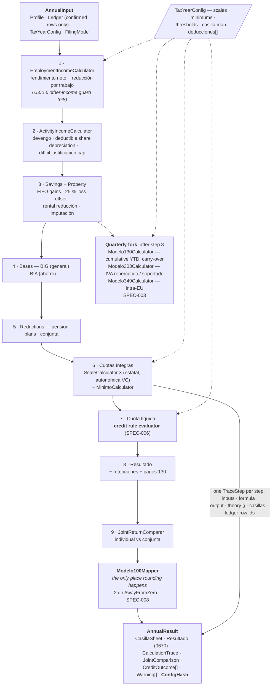
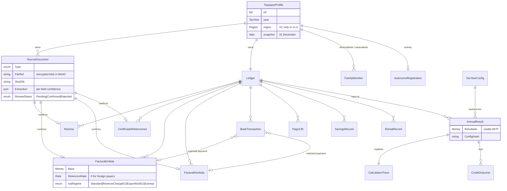

# Architecture Analysis

Component-level view of the system. The container-level picture and the prose that
explains it live in `docs/architecture.md`; project-to-project dependencies and the
rules that enforce them live in `graph/dependencies.md`. This file covers what is
*inside* the two things that carry the product: the calculation engine and the domain
model — plus an honest account of how much of it exists today.

---

## Components

### The engine — a pure function, nine steps, one trace

`IrpfAnnualCalculator.Run(profile, ledger, yearConfig)` is the whole product in one
call. It performs no I/O, reads no clock and touches no database, so the same input
produces a byte-identical trace every time (SPEC-002 §8).

Three invariants the diagram encodes:

- **No rounding inside steps.** `Modelo100Mapper` rounds each casilla to 2 dp
  `AwayFromZero`, and `Resultado` is recomputed from the rounded casillas to match how
  AEAT presents it. The unrounded value stays in the trace (SPEC-002 §5).
- **A missing regional scale is a hard error.** The engine never falls back to the
  state scale (SPEC-002 §7, business rule 9).
- **Every result carries a `ConfigHash`.** A figure can always be re-derived from the
  exact config file that produced it (ADR-0003).

`FilingObligationChecker` sits beside the pipeline rather than in it: the engine always
calculates, and the obligation answer is informational (SPEC-002 §4).

### The domain model — the ledger is the core

Value objects: `Money` (decimal EUR, explicit `Round2()`) · `Rate` · `TaxYear` ·
`Region` (ISO 3166-2:ES) · `Nif` (checksum-validated) · `Quarter` · `OfficeShare` ·
`DeductibleShare`.

Rules the arrows carry, from `knowledge/business-rules.md`:

- No ledger row without a **confirmed** `SourceDocument`.
- No deductible expense without a linked `FacturaRecibida`.
- Ledger rows are immutable after confirmation; a correction is a new version with
  history, not an update in place (SPEC-001 §5).
- `CertificadoRetenciones` overrides Σ nóminas, and a mismatch over 1 € raises a warning
  rather than silently picking one.

Prose definitions of these entities stay in `knowledge/domain-model.md`; this diagram is
the shape, not a second copy of the definitions.

### Component inventory

| Component | Project | Spec |
|---|---|---|
| `ScaleCalculator`, `MinimoCalculator`, the five income calculators | `GestorIA.Engine` | SPEC-002 |
| `IrpfAnnualCalculator`, `JointReturnComparer`, `CalculationTrace` | `GestorIA.Engine` | SPEC-002 |
| `Modelo130Calculator`, `Modelo303Calculator`, `Modelo349Calculator` | `GestorIA.Engine` | SPEC-003 |
| Credit rule evaluator (condition DSL over a flat fact bag) | `GestorIA.Engine` | SPEC-006 |
| `Modelo100Mapper`, `FilingObligationChecker` | `GestorIA.Engine` | SPEC-002/008 |
| Explanation generator (ES/EN/RU resources) | `GestorIA.Application` | SPEC-010 |
| `IStatementParser` implementations, invoice JSON and AEAT XML parsers | `GestorIA.Infrastructure` | SPEC-004 |
| Transaction classifier, invoice ↔ transaction matcher | `GestorIA.Infrastructure` | SPEC-004 |
| `TaxYearConfigLoader` (**not** in the Engine — SPEC-007 §3) | `GestorIA.Infrastructure` | SPEC-007 |
| `IDocumentExtractor` client, `IExtractJobQueue`, `IFileStorage` | `GestorIA.Infrastructure` | SPEC-005, ADR-0009/0015 |

---

## Gap vs target

Everything above is the target. What exists on `ticket-4` today:

| Element | Reality |
|---|---|
| `GestorIA.Application` | **Does not exist.** Not in `GestorIA.slnx`, not on disk |
| `GestorIA.Engine` | `.csproj` + `BannedSymbols.txt` only — zero `.cs` files; referenced by nothing but its test project |
| `GestorIA.Api` | `.csproj` only — no `Program.cs`, no endpoints |
| `GestorIA.Domain` | 3 files: the prototype `Transaction`, `Result<T>`, `IStatementParser` |
| `GestorIA.Infrastructure` | 1 file: `BbvaCsvStatementParser` |
| `web/` | Does not exist; CLI vs SPA is still open, decided at M3 |
| `services/ocr` | README only — no Python, no `pyproject.toml` |
| PostgreSQL, EF Core, MinIO client | No packages referenced; `Directory.Packages.props` has 5 entries, none of them persistence |
| Docker Compose, Dockerfiles | Documented, not written |
| Golden tests G1–G10 | `tests/golden/` does not exist; no calculator, no fixture |
| `config/tax-years/2025.json` | Still `2025.example.json` with 4 `_todo` blocks; `deducciones`, `modelo349` and `provenance` are bare placeholders in `schema.json` |
| ADR status | **0002, 0005 and 0009 are `Proposed`** — the OCR service, the REST/JSON-Schema contract and the `Channel<T>` queue are decisions not yet felt |

Dashed boxes on the diagrams in `docs/architecture.md` mean a row in this table.

---

## Risks

- **The engine is the only component with no fallback.** A wrong figure is not a bug
  the user can route around; it is a wrong filing. Mitigation is the golden set
  (SPEC-011) and the oracle ranking in ADR-0011 — and none of it exists yet.
- **Purity is a property nobody currently checks.** `GestorIA.Engine` has no code, so
  the "no EF Core, no HTTP, no clock" rule has never been tested against a real
  temptation. The first `DateTime.Now` inside a calculator will look reasonable.
- **The config is a second codebase.** `config/tax-years/YYYY.json` carries every
  number that can make a filing wrong, and `schema.json` still has three bare
  placeholders. Schema coverage is what stands between a typo and a wrong casilla.
- **The trace is load-bearing but downstream.** SPEC-010's explanations, the credit
  outcomes and the casilla provenance all read from `CalculationTrace`. Designing it
  after the calculators would make it a log rather than a data structure.
- **Three `Proposed` ADRs sit under drawn boxes.** The OCR service, its REST contract
  and the in-process job queue are on the diagrams because they are the plan, not
  because they have been felt.

## Improvements

- Design `CalculationTrace` before the second calculator, not after the last one — it
  is an output of the engine, not instrumentation added to it.
- Add an architecture test asserting that `GestorIA.Engine` references only
  `GestorIA.Domain`, so the purity rule survives a hurried commit. The
  `BannedApiAnalyzers` setup already proves the pattern works.
- Close the three `schema.json` placeholders (`deducciones`, `modelo349`, `provenance`)
  before the first credit rule is written; a rule engine fed by an unvalidated array is
  a silent-failure machine.
- Regenerate the gap table in this file whenever a phase closes. It is the section that
  goes stale first, and a stale gap table is worse than none.
