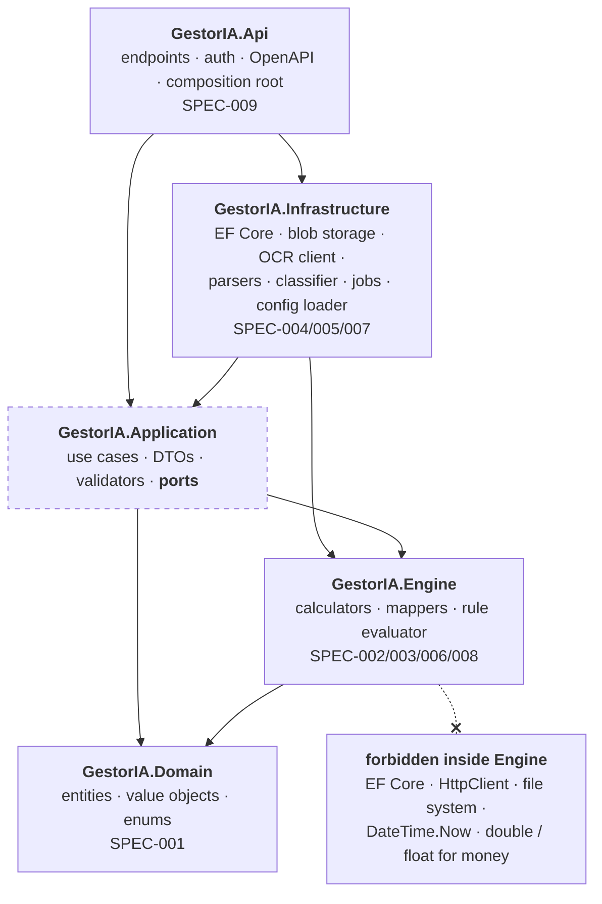

# Dependency Analysis

How the solution is built: which project may reference which, what enforces it, and
what the system depends on from outside. Component internals are in
`graph/architecture.md`; the container picture is in `docs/architecture.md`.

---

## Internal Dependencies

Arrows point inward only. Nothing in the inner rings knows the outer ones exist.

`GestorIA.Application` is dashed because it does not exist yet — a Phase 0 deliverable
(`plans/current.md`). Today the graph is `Api → Infrastructure → Engine → Domain`,
with `Infrastructure → Domain` as well. `Infrastructure` references `Engine` directly
because `TaxYearConfigLoader` builds the Engine's `TaxYearConfig`. The edge stays when
`Application` exists; it only gains an indirect path through it. `GestorIA.Engine.Tests` references `Infrastructure`
to load the real `config/tax-years` files instead of hand-copying their numbers.

Two edges are deliberate and easy to get wrong:

- **`Infrastructure → Application`, not the reverse.** The ports are interfaces owned
  by `Application`; `Infrastructure` implements them. `Api` is the composition root
  that wires the two, which is why it references both.
- **The config loader is in `Infrastructure`.** SPEC-007 §3 is explicit about it: put
  file reading in the Engine and "the engine's purity becomes a comment rather than a
  property". The Engine receives an already-parsed, already-hashed `TaxYearConfig`.

### What enforces each rule

Every rule below is a build or test failure, not a convention in a document.

| Rule | Enforced by | Where |
|---|---|---|
| Arrows point inward only | project references | `GestorIA.slnx`, each `.csproj` |
| No `double` / `float` for money (ADR-0004) | `BannedApiAnalyzers`, plus a guard test for declarations the analyzer cannot see | `src/GestorIA.Engine/GestorIA.Engine.csproj`, `src/GestorIA.Engine/BannedSymbols.txt`, `tests/GestorIA.Engine.Tests/NoBinaryFloatsInEngine.cs` |
| Any warning fails the build | `TreatWarningsAsErrors` + `MSBuildTreatWarningsAsErrors` | `Directory.Build.props` |
| One version per package, solution-wide | central package management | `Directory.Packages.props` |
| No tax number in code (ADR-0003) | JSON Schema + cross-field rules, run by the loader on every load and by the tests on every file | `config/tax-years/schema.json`, `src/GestorIA.Infrastructure/TaxYears/TaxYearConfigValidator.cs`, `tests/GestorIA.Engine.Tests/TaxYearFilesAreValid.cs` |
| Determinism | golden tests, FsCheck property tests, `ConfigHash` on every result | `tests/GestorIA.Engine.Tests/` |
| Sole authorship | `commit-msg` hook rejecting AI and co-author trailers | `.githooks/commit-msg` |
| `main` stays green | GitHub Actions: restore → build → test on .NET 10 | `.github/workflows/ci.yml` |

An architecture test asserting the reference graph itself is still missing; see
`graph/architecture.md` → Improvements.

---

## External Dependencies

### Referenced today

`Directory.Packages.props` holds five entries, all of them about correctness rather
than features:

| Package | Why |
|---|---|
| `Microsoft.CodeAnalysis.BannedApiAnalyzers` 4.14.0 | ADR-0004 — `double` / `float` in the Engine is a build error |
| `JsonSchema.Net` 9.4.0 | validating `config/tax-years/*.json` against `schema.json`, in `Infrastructure` at load |
| `Microsoft.NET.Test.Sdk` 18.9.0 · `xunit` 2.9.3 · `xunit.runner.visualstudio` 4.0.0 | the test host |

### Planned, per spec and ADR

| Dependency | Consumer | ADR / spec |
|---|---|---|
| PostgreSQL 16 + EF Core | `Infrastructure` | ADR-0006 — chosen for exact `numeric`, since SQLite cannot hold a `decimal` |
| ASP.NET Core minimal API, OpenAPI 3.1 | `Api` | SPEC-009 |
| FluentValidation | `Application` | Phase 3 |
| Polly | `Infrastructure` — retry / circuit breaker around the OCR client | SPEC-005 |
| MinIO / S3-compatible client | `Infrastructure` behind `IFileStorage` | ADR-0015 |
| Serilog, OpenTelemetry | `Api` | `docs/architecture.md` → Observability |
| FsCheck, Stryker.NET, Testcontainers | tests | SPEC-011 |
| PaddleOCR, OpenCV, FastAPI, Pydantic, pypdfium2 | `services/ocr` | ADR-0002 *(Proposed)* |
| React 19, Vite, TanStack Query, i18next | `web/` | ADR-0007 |

### Outside the software

| Dependency | Nature | Failure mode |
|---|---|---|
| AEAT Renta WEB + Open Simulador | manual, no API; both the filing destination and the golden-value oracle (ADR-0011) | the simulator cannot express Modelo 130/303/349, so those goldens need published examples or a gestor |
| BOE / AEAT Manual | source of every 📅 value, transcribed by hand once a year | 2027 values do not publish until roughly December 2026 — a hard schedule dependency for M6 |
| Bank statement exports | files, not APIs, one format per bank | a format change breaks one `IStatementParser`, nothing else |
| TGSS | cuota and tramos feed `seguridadSocial` in the config | needed before the January 2027 registration decision, not by any code path |
| MinIO on the author's VPS | encrypted blob store | the Engine never reads documents, so an outage cannot block a calculation |
| Optional LLM (Ollama or free tier) | invoice structuring, off by default | feature-flagged; the heuristic extractor is the default path |

---

## Dependency Risks

- **Nothing depends on the Engine yet.** It has no code and no consumer, so the
  layering above is a design, not an observed property. The first `Application` use
  case is what makes the graph real.
- **The `Engine → Domain` edge carries the prototype.** `GestorIA.Domain` still holds
  the prototype `Transaction` (signed amount implies income or expense), which SPEC-001
  says to migrate rather than extend. It survives only as the BBVA parser's output
  type; a calculator reaching for it would bake the prototype into the engine.
- **Three `Proposed` ADRs sit under real edges.** ADR-0002 (Python OCR service),
  ADR-0005 (REST + JSON Schema contract) and ADR-0009 (in-process `Channel<T>` queue)
  are drawn because they are the plan, not because they have been felt. The OCR
  dependency in particular is deferred to v1.x and may change shape before it lands.
- **The JSON config is an untyped dependency of the Engine.** `deducciones`,
  `modelo349` and `provenance` are still bare placeholders in `schema.json`; until they
  are modelled, a malformed rule reaches the evaluator as valid input.
- **Two ecosystems, one developer.** The .NET and Python halves each carry their own
  toolchain, CI lane and upgrade cadence. ADR-0002 keeps the Python surface to one
  stateless endpoint precisely to bound this, and it is deferred to v1.x for the same
  reason.
- **The generated TypeScript client couples `web/` to OpenAPI output.** It is a build
  dependency in one direction only, and SPEC-009 §5 keeps it honest with an OpenAPI
  diff check in CI — which is not wired up yet.
